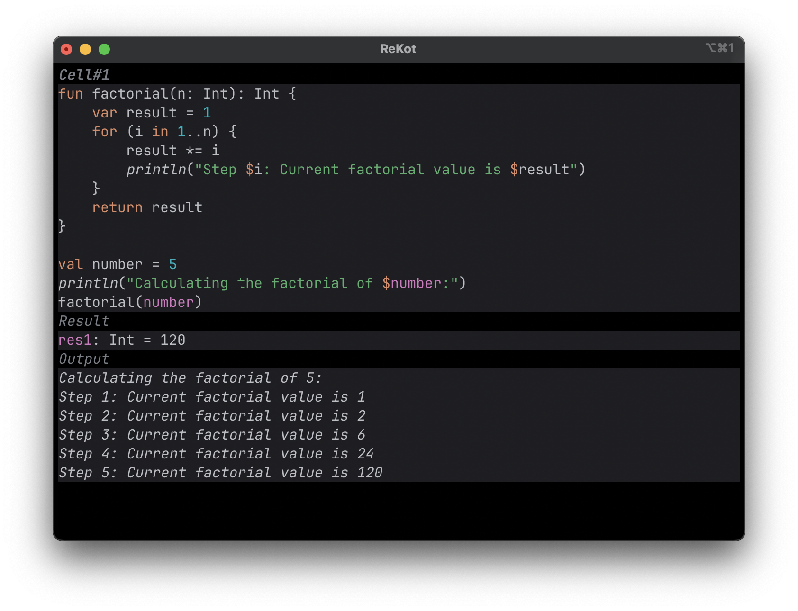
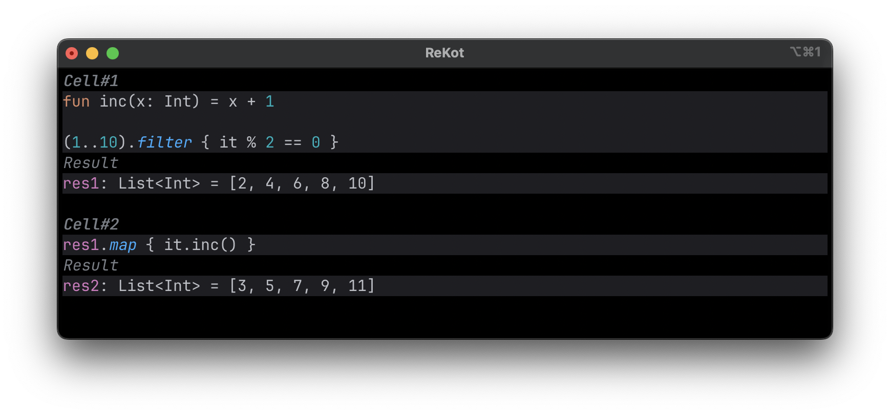
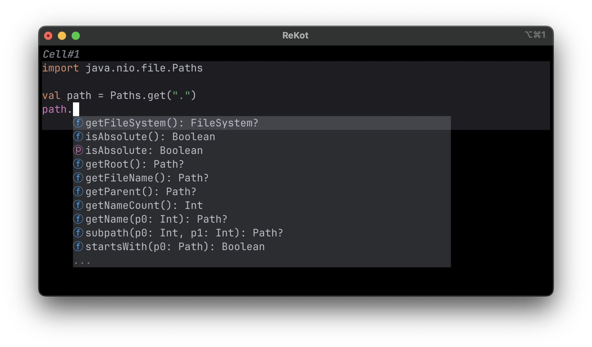
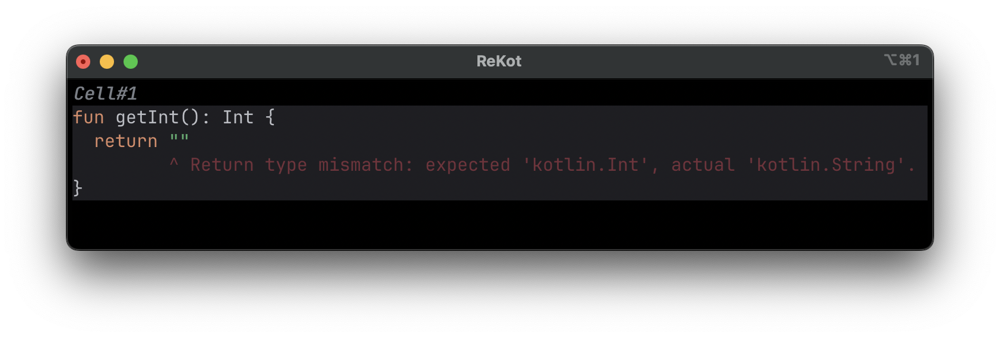

<p align="left">

</p>
<h1 align="left">ReKot</h1>

##### <i>Kotlin REPL with an IDE-like experience in your terminal</i>

[](https://github.com/darthorimar/rekot/releases/latest)

## ⚙️ Installation

_Make sure you have the JDK installed_

Paste this into the terminal:

```bash
bash <(curl -s https://raw.githubusercontent.com/darthorimar/rekot/master/install.sh)
```

Or if you prefer wget:

```bash
bash <(wget -qO- https://raw.githubusercontent.com/darthorimar/rekot/master/install.sh)
```

## ✨ Features

### Multiline Code Editing

A full-fledged multiline code editor with code highlighting


### Multiple Cells

With results that can be reused between the cells


### Code Completion



### In-editor Code Highlighting


## 🛠️ Building ReKot
TODO

## ⚠️ Known Problems

On macOS Sonoma, some text may be printed on the terminal like:
```
2025-01-28 23:39:24.855 java[2091:30776] +[IMKClient subclass]: chose IMKClient_Modern
2025-01-28 23:39:24.855 java[2091:30776] +[IMKInputSession subclass]: chose IMKInputSession_Modern
```

See https://discussions.apple.com/thread/255761734

As a workaround:
- On Mac systems, ReKot occasionally fully refreshes the screen at some interval.
- You can press `Ctrl+R` to manually refresh the screen.